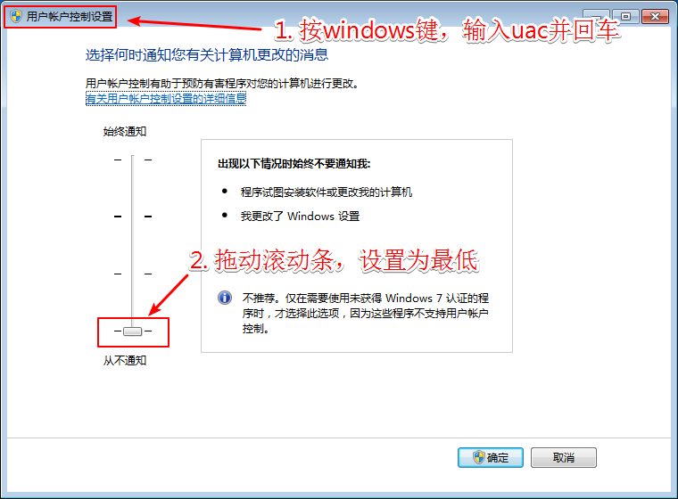
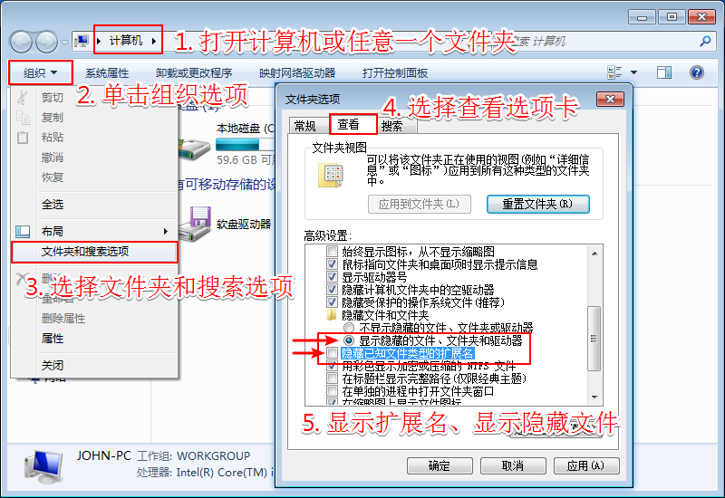
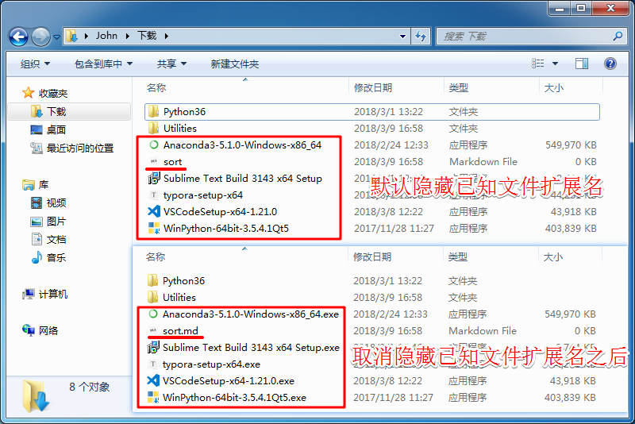

# 计算机基础知识

## 1. 计算机的定义及分类

**定义**：能够进行计算或者运算的一种电子设备(Computer)，俗称“电脑”

**分类**：台式电脑、笔记本电脑、服务器、工作站、手机...

## 2. 计算机组成

### 硬件

1. 中央处理器CPU: Intel, AMD, ARM, PowerPC, ...
2. 内存Memory: 4G/8G
3. 硬盘Disk: 机械硬盘500G、1T、2T; 固态硬盘120G、240G
4. 主板Motherboard: ATX, Micro ATX, BTX(支持CPU、接口、内存大小 )
5. 输入输出设备：显示器、键盘、鼠标、光驱、摄像头、麦克风...
6. 电源Power
7. 显卡

### 软件

1. 系统软件
   - Windows/Linux/Mac OS X
   - Android/iOS
2. 应用软件
   - Windows: QQ, Microsoft Office, WPS, ...
   - Linux: LibreOffice, Calculator, ...
   - Mac OS X: Keynote, XCode, Microsoft Office, ...
   - Android/iOS: QQ, 微信, 百度地图, 头条, 微博, ...

## 3. 操作系统

### 电脑操作系统

1. Windows: 
   - Windows **XP**/Vista
   - Windows **7**/8/**10**
2. Linux: 
  - RedHat:  Fedora, Red Hat Enterprise Linux , **CentOS**, Scientific Linux
  - **Debian:** **Ubuntu**, **Kali**, **Kylin**, **Raspbian**, Chrome OS, Linux Mint...
  - SUSE: SUSE Linux Enterprise, openSUSE
3. Mac OS X
4. VxWorks
5. DOS, Unix, FreeBSD...

### 手机操作系统: 

1. Android
2. iOS
3. Windows Phone/Ubuntu/Symbian/MeeGo...

## 4. Windows常用命令

按`Windows`键或者`Windows+ R`并输入`cmd`后回车(按`Enter`键)可打开控制台界面，在控制台里可输入各种命令

按`Windows`键或者`Windows+ R`并输入`powershell`后回车可打开增强版控制台界面，在`PowerShell`里输入命令

**cd**(change directory)：切换工作目录

​	提示：输入cd后可将某个文件夹直接拖进来，或者把文件夹路径复制之后利用鼠标右键粘贴过来，然后回车

切换到某一盘符根目录直接输入`X:`并回车(X为盘符号)，例如输入`C:`回车

**dir**(directory)：列出当前工作目录下的文件及文件夹信息

**exit**：退出控制台界面

**小提示：**

按`Windows`键或者`Windows+ R`并输入`calc`后回车可快速打开系统自带的**计算器**

按`Windows`键或者`Windows+ R`并输入`mspaint`后回车可快速打开系统自带的**绘图板**

## 5. Windows常用设置

1.  关闭烦人的权限通知

   按`Windows`键，输入`uac`并回车，将通知权限设为最低，按以下步骤操作之后点击`确定` 。

   

2. 显示已知文件的扩展名，显示隐藏文件，按以下步骤操作之后点击`确定` 。

    

    文件扩展名取消隐藏前后对比：

    

