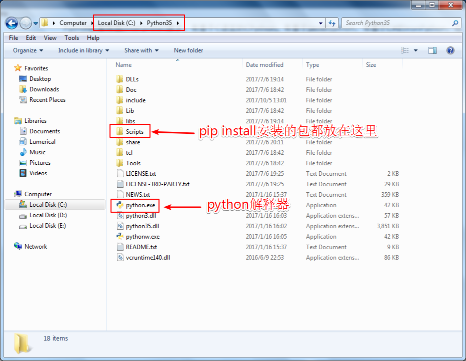
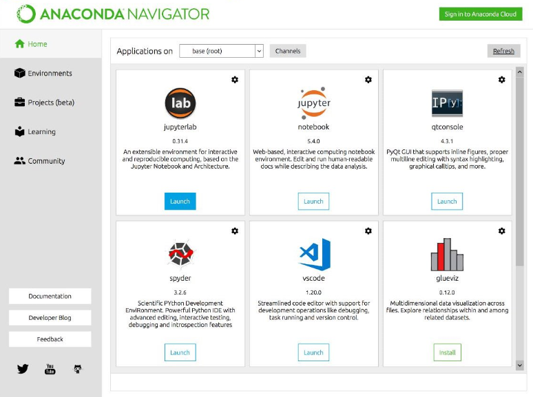

# Windows平台开发环境搭建

搭建Python开发环境的方法非常多，这里列出了部分常用的搭建方法，仅供参考。

## 1 安装Python解释器

Python的解释器(interpreter)很多，有基于C语言的CPython，有基于Java的Jython，有基于C#的IronPython，还有基于RPython的解释器PyPy，**但主要还是用CPython解释器。当谈到Python时，一般指的是CPython**。以下安装的解释器都是CPython解释器。

### 方法1：安装官网[**Python**](https://www.python.org/downloads/)

官网下载Python 3.6/3.5/2.7 版本，双击一步步安装，注意**勾选**`Add python.exe to path`和`pip`命令。

安装完成之后，进入cmd命令行输入python，如果不能进入python开发环境，请把python.exe所在的路径`C:\Python35`添加到系统环境变量Path中

cmd命令行执行 **pip install numpy-mkl matplotlib docopt opencv-python dlib**

在采用**pip install _package-name_**时，可以使用**pip search _package-name_**搜索一下，安装时保持网络通畅。

Window平台通常采用[**非官方**](https://www.lfd.uci.edu/~gohlke/pythonlibs/)的安装方法更便捷，基本不会出错:

1. 下载与Python版本相对应的扩展包`*.whl`文件，命令行切换至`*.whl`文件所在的文件夹，执行`pip install *.whl`
2. 首先安装**numpy+mkl**扩展包，很多扩展包都依赖于这个包，比如matplotlib、opencv-python
3. Windows 10尽量用**管理员**权限在**PowerShell**中运行**pip**命令

dlib的安装需要Visual Studio 2010/2013/2015 C++编译器，建议在[**WinPython**](http://winpython.github.io/)或者[**Anaconda**](https://www.continuum.io/downloads)的环境下安装。

学会使用Python命令行、后缀 `.py`文本文件、GUI编辑运行调试代码。

### 方法2：安装[**WinPython**](http://winpython.github.io/)或者[**Python(x,y)**](http://python-xy.github.io)

直接安装即可，安装完成之后可直接使用ipython, Jupyter Notebook (ipython notebook), Spyder等GUI环境。

WinPython集成了丰富的扩展包，如果要在此基础之上用文本编辑器或集成开发工具搭建开发环境，需要将python.exe和pip.exe所在路径添加至系统环境变量。

在**Anaconda Prompt**环境下采用**conda install _package-name_**安装各种拓展包。

### 方法3：安装[**Anaconda**](https://www.continuum.io/downloads)

直接安装即可，安装完成之后可直接使用ipython, Jupyter Notebook (ipython notebook), Spyder等GUI环境。

**Anaconda集成了丰富的扩展包，可以进行数据分析、Web开发和机器学习，无需安装其它扩展包**。

在**Anaconda Prompt**环境下采用**conda install _package-name_**安装各种拓展包。

### 方法4：使用virtualenv等工具虚拟一个Python环境

## 2 利用文本编辑器搭建Python开发环境

### 2.1 VS Code配置Python开发环境

1. 下载并安装[**Visual Studio Code**](https://code.visualstudio.com/Download)编辑器

2. 打开**VS Code**编辑器，并安装python插件

   

3. 学会使用**VS Code**来编写、调试、运行Python代码

   ​

### 2.2 Sublime Text配置Python开发环境

### 2.3 Notepad++配置Python开发环境

安装[Notepad++](https://notepad-plus-plus.org/)，设置字体、行号、显示方案。

启动Notepad++，点击运行-运行-输入cmd /k python "$(FULL_CURRENT_PATH)" & ECHO. & PAUSE & EXIT 并保存，设置快捷键(Ctrl+Alt+P)，参考这里的一个[教程](http://www.cnblogs.com/zhcncn/p/3969419.html)。

**注意: 如果Python不是安装在默认的安装路劲，务必将上一句的cmd /k 后面的python前添加完整路径。[举例](http://blog.csdn.net/evabook/article/details/52261282)如果直接将WinPython安装在C盘，则要用C:\WinPython-32bit-2.7.9.2\python-2.7.9\python.exe替换掉cmd /k 后面的python**

## 3 利用集成开发工具搭建Python开发环境

专业的集成开发工具功能强大，有智能提示、断点调试等功能，缺点是启动速度慢。

### 3.1 PyCharm

**安装PyCharm之前请确保已经安装好了[JRE](http://www.oracle.com/technetwork/java/javase/downloads/jre8-downloads-2133155.html)或者[JDK](http://www.oracle.com/technetwork/java/javase/downloads/jdk8-downloads-2133151.html)，和一个Python解释器**。

如果安装**PyCharm**时没有安装**Python解释器**，**PyCharm**会下载并安装一个指定的**Python 2.7/3.6**解释器。

[**PyCharm Community**](https://www.jetbrains.com/pycharm/download/#section=windows)是一个轻量级的Python科学计算开发工具，开源、**免费**、**跨平台**。

[**PyCharm Edu**](https://www.jetbrains.com/pycharm-edu/)是在[**PyCharm Community**](https://www.jetbrains.com/pycharm/download/#section=windows)基础之上增加了教学功能，开源、**免费**、**跨平台**。

[**PyCharm Professional**](https://www.jetbrains.com/pycharm/download/#section=windows)是一个全功能跨平台的Python Web开发工具，30天免费试用，长期使用需要购买。

安装好**PyCharm**之后需要先新建项目，指定一个**Python解释器**后可新建、编辑、运行并调试Python文件，**PyCharm**提供了包(package)管理工具，也可使用pip安装各种package。

### 3.2 Eclipse + PyDev

**使用Eclipse+PyDev之前请确保已经安装好了[JDK](http://www.oracle.com/technetwork/java/javase/downloads/jdk8-downloads-2133151.html)和一个Python解释器**。

[**Eclipse**](https://www.eclipse.org/downloads/)是一个开源、**免费**、**跨平台**的开发工具，可以用来开发Java、C/C++、PHP等项目。

安装好[**Eclipse**](https://www.eclipse.org/downloads/)之后需要安装[**PyDev**](http://www.pydev.org/)插件，然后新建Python Project，指定一个**Python解释器**后可新建、编辑、运行并调试Python文件，使用pip安装各种包(package)。

### 3.3 Visual Studio + PTVS

**使用Visual Studio + PTVS之前请确保已经安装好了Python解释器**。

[**Visual Studio Community 2015/2017**](https://www.visualstudio.com/zh-hans/vs/community/)是**Windows 10**平台**免费**的C/C++/C#集成开发工具。

[**Windows 10**](https://www.microsoft.com/zh-cn/windows) 上安装[**Visual Studio Community 2015/2017**](https://www.visualstudio.com/zh-hans/vs/community/)时，勾选**PTVS或者Python模块**。

安装完成之后需要先新建项目，指定一个**Python解释器**后可新建、编辑、运行并调试Python文件。

# Linux平台开发环境搭建

#  Mac OS X平台开发环境搭建

大多数OS X系统默认安装了Python，打开终端Terminal，输入Python或者Python -V可以查看Python版本信息。

1. 下载[**Python**](https://www.python.org/downloads/)或者[**Anaconda**](https://www.continuum.io/downloads)的MacOS版安装包，直接安装

