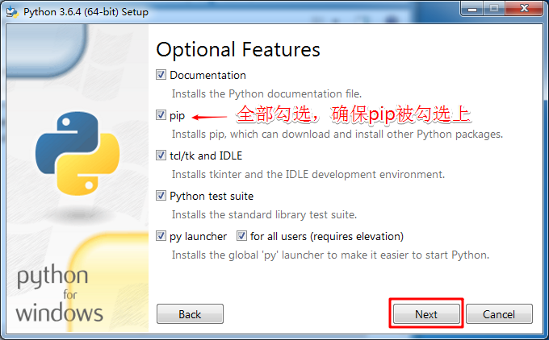
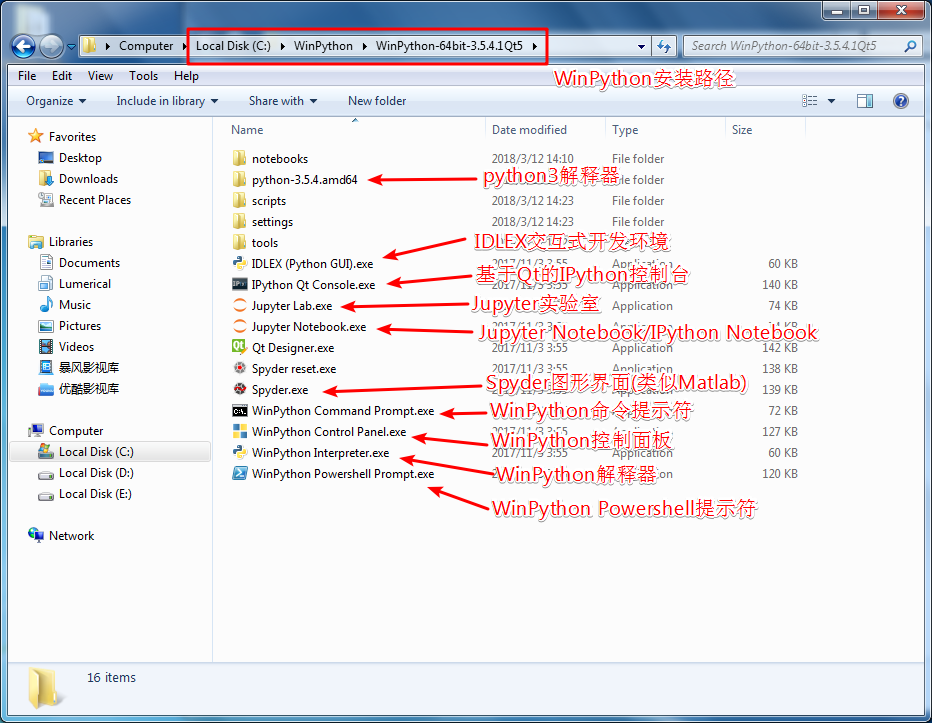
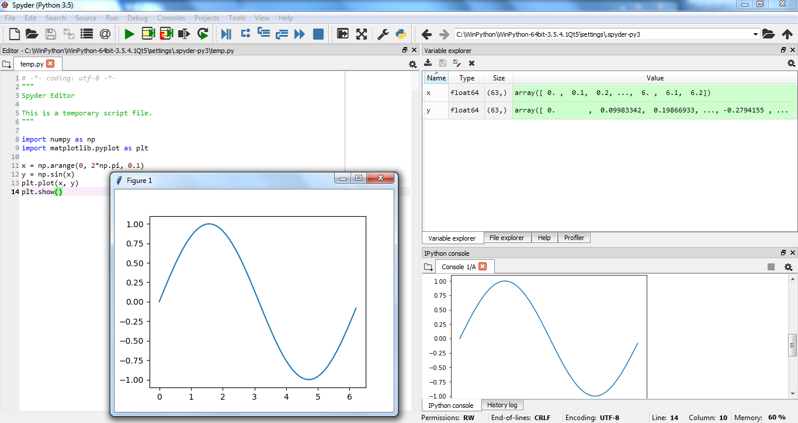
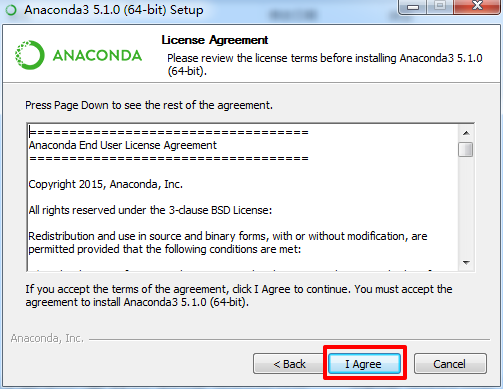

# Windows平台开发环境搭建

搭建Python开发环境的方法非常多，这里列出了部分常用的搭建方法，仅供参考。

## 1 安装Python解释器

Python的解释器(interpreter)很多，有基于C语言的CPython，有基于Java的Jython，有基于C#的IronPython，还有基于RPython的解释器PyPy，**但主要还是用CPython解释器。当谈到Python时，一般指的是CPython**。以下安装的解释器都是CPython解释器。

### 方法1：安装官网[**Python**](https://www.python.org/downloads/)

官网下载Python 3.6/3.5/2.7 版本，双击一步步安装，注意**勾选**`Add Python 3.6 to Path`和`pip`命令。

安装完成之后，进入cmd命令行输入python，如果不能进入python开发环境，请把python.exe所在的路径(例如：`C:\Program Files\Python36`)添加到系统环境变量Path中。

在安装Python之前，需要知道操作系统版本，这里采用的是64位Window 7 SP1 简体中文版。

64位Windows操作系统建议安装64位的Python 3.5/3.6版本，也可以安装32位的Python版本。32位的Windows操作系统只能安装32位的Python版本。Windows 7/8/10可以安装任何一个版本的Python，Windows XP系统只能安装Python 2和Python 3.4。

这里以64位Python 3.6版本为例，演示完整安装过程。

**Step 1：下载官网Python 3.6版本的安装文件**

通过浏览器访问Python官方官网**https://www.python.org**

**Step 2：双击下载的exe文件进行安装**

**Step 3：开始编写运行程序** 

**pip安装扩展包packages：**

cmd命令行执行 **pip install numpy-mkl scipy matplotlib ipython jupyter notebook spyder**等等

在采用**pip install _package-name_**时，可以使用**pip search _package-name_**搜索一下，安装时保持网络通畅。

Window平台通常采用[**非官方**](https://www.lfd.uci.edu/~gohlke/pythonlibs/)的安装方法更便捷，基本不会出错:

1. 下载与Python版本相对应的扩展包`*.whl`文件，命令行切换至`*.whl`文件所在的文件夹，执行`pip install *.whl`(文件名长可以用tab键补全)，安装好之后可以在控制台使用pip list查看已安装的扩展包。

2. 首先安装**numpy+mkl**扩展包和相应的Visual C++ 2008/2010/2013/2015/2017 redistributable，很多扩展包都依赖于这个包，比如matplotlib、opencv-python。

   > Many binaries depend on [numpy-1.13+mkl](https://www.lfd.uci.edu/~gohlke/pythonlibs/#numpy) and the Microsoft Visual C++ 2008 ([x64](https://www.microsoft.com/en-us/download/details.aspx?id=15336), [x86](https://www.microsoft.com/en-us/download/details.aspx?id=29), and [SP1](https://www.microsoft.com/en-us/download/details.aspx?id=26368) for CPython 2.7), Visual C++ 2010 ([x64](https://www.microsoft.com/en-us/download/details.aspx?id=14632), [x86](https://www.microsoft.com/en-us/download/details.aspx?id=5555), for CPython 3.4), or the Visual C++ 2017 ([x64 or x86](https://support.microsoft.com/en-us/help/2977003/the-latest-supported-visual-c-downloads) for CPython 3.5, 3.6, and 3.7) redistributable packages.

3. 某些库，比如dlib在安装时需要C++编译器，这时需要安装Visual Studio 2010/2013/2015 C++编译器或者MinGW C++编译器，也可以在[**WinPython**](http://winpython.github.io/)或者[**Anaconda**](https://www.continuum.io/downloads)的环境下直接使用pip或者conda安装。

4. Windows 10尽量用**管理员**权限在**Powershell**中运行**pip**命令。

   

**Python程序的运行：**

1. 在Windows命令行输入python或者ipython打开REPL交互式环境，逐句输入代码并执行

2. 用IDLE编写运行Python代码和`.py`文件

3. 用Jupyter Notebook/Jupyterlab编写运行代码

4. 在Spyder中编写运行代码

### 方法2：安装[**WinPython**](http://winpython.github.io/)或者[**Python(x,y)**](http://python-xy.github.io)

WinPython自带Python 3的解释器，集成了非常丰富的扩展包，几乎可以满足绝大部分开发者的需要，是一个免费便携的Python发行版。Python(x, y)集成了Python 2.7的解释器和丰富的扩展包，现已停止更新。

WinPython和Python(x, y)都只能运行在Windows平台上。

**WinPython的安装：**

下载WinPython之后直接安装即可，双击安装包WinPython-64bit-3.5.4.1Qt5.exe进行安装（这里演示的是WinPython-64bit-3.5的版本）。

Step 1：同意安装协议，不同意自动退出安装

Step 2：设置安装路径，直接更改或点击Browse

Step 3：正在安装

Step 4：查看安装细节，安装过程是一个解压过程

Step 5：等待安装完成

Step 6：完成安装

**WinPython的使用**：

安装完成之后可直接使用WinPython集成的IDLEX, ipython, Jupyter Notebook(ipython notebook), Spyder等工具，双击相应的.exe文件直接运行。

notebooks文件夹放置了部分文档手册，ipynb格式(ipython notebook)。

python-3.5.4.amd64文件夹放置了python3解释器，其子文件夹Scripts放置了pip安装的第3方扩展库。

settings文件夹保存了部分配置文件，比如Jupyter Notebook默认的启动路径。

IDLEX是一个Python 3.5 Shell，一个交互式的Python运行环境，可以直接运行Python代码，也可以编写调试运行Python文件。

IPython Qt Console是一个利用Qt开发的IPython控制台界面，现已更名为Jupyter QtConsole。

Jupyter Lab是一个Jupyter实验室，可以在网页端编写调试python程序。

Jupyter Notebook是一个交互式笔记本(以前叫ipython notebook)，可以边写代码边执行，使用非常方便，现在已经成为数据科学和数据分析的标配。

Qt Designer是基于Qt的跨平台GUI图形界面开发程序。

Spyder是一个类似于Matlab的软件界面，可以很方便的编写、调试、运行python程序。

WinPython Command Prompt是一个WinPython的命令提示符，在该命令提示符下采用**pip**来管理各种拓展包、调用WinPython的解释器来运行Python程序。

WinPython Control Panel是WinPython的控制面板，可以查看已安装的包，也可以将WinPython添加至系统菜单。

WinPython Interpreter是一个WinPython解释器。

WinPython Powershell Prompt是一个增强型的WinPython Command Prompt程序。

如果要在此基础之上用文本编辑器或集成开发工具搭建开发环境，需要将python-3.5.4.amd64文件夹下的python.exe所在路径(C:\WinPython\WinPython-64bit-3.5.4.1Qt5\python-3.5.4.amd64)和python-3.5.4.amd64/Scripts文件夹下的pip.exe所在路径(C:\WinPython\WinPython-64bit-3.5.4.1Qt5\python-3.5.4.amd64\Scripts)添加至系统环境变量，把其它python.exe和pip.exe所对应的系统环境变量删除。

### 方法3：安装[**Anaconda**](https://www.continuum.io/downloads)

**Anaconda集成了丰富的扩展包，可以进行数据分析、Web开发和机器学习，无需安装其它扩展包**。

直接安装即可，安装完成之后可直接使用jupyterlab,jupyter notebook (ipython notebook), ipython qtconsole, spyder等GUI环境，也可以使用在vscode文本编辑器中编写运行调试python文件。

在**Anaconda Prompt**环境下采用**conda install _package-name_**安装各种拓展包。

**Anaconda安装步骤如下：**

Step 1: 双击Anaconda3-5.1.0-Windows-x86_64.exe安装包

Step 2: 接受安装协议，不接受不能安装

Step 3: 为所有用户安装

Step 4: 更改安装路径

Step 5: 设置系统变量

Step 6: 正在安装

Step 7: 正在安装，显示安装细节

Step 8: 安装完成

Step 9: 安装VS Code(可跳过)

Step 10: 正在安装VS Code

Step 11: VS Code安装完成

Step 12: 完成安装Anaconda3

### 方法4：使用virtualenv等工具虚拟一个Python环境

在以上基础之上，使用virtualenv等工具创建一个Python虚拟环境。

## 2 利用文本编辑器搭建Python开发环境

### 2.1 VS Code配置Python开发环境

1. 下载并安装[**Visual Studio Code**](https://code.visualstudio.com/Download)编辑器

2. 打开**VS Code**编辑器，并安装python插件

   

3. 学会使用**VS Code**来编写、调试、运行Python代码

### 2.2 Sublime Text配置Python开发环境

### 2.3 Notepad++配置Python开发环境

安装[Notepad++](https://notepad-plus-plus.org/)，设置字体、行号、显示方案。

启动Notepad++，点击运行-运行-输入cmd /k python "$(FULL_CURRENT_PATH)" & ECHO. & PAUSE & EXIT 并保存，设置快捷键(Ctrl+Alt+P)，参考这里的一个[教程](http://www.cnblogs.com/zhcncn/p/3969419.html)。

**注意: 如果Python不是安装在默认的安装路劲，务必将上一句的cmd /k 后面的python前添加完整路径。[举例](http://blog.csdn.net/evabook/article/details/52261282)如果直接将WinPython安装在C盘，则要用python解释器所在的路径(C:\WinPython\WinPython-64bit-3.5.4.1Qt5\python-3.5.4.amd64\python.exe)替换掉cmd /k 后面的python**

## 3 利用集成开发工具搭建Python开发环境

专业的集成开发工具功能强大，有智能提示、断点调试等功能，缺点是启动速度慢。

### 3.1 PyCharm

**安装PyCharm之前请确保已经安装好了[JRE](http://www.oracle.com/technetwork/java/javase/downloads/jre8-downloads-2133155.html)或者[JDK](http://www.oracle.com/technetwork/java/javase/downloads/jdk8-downloads-2133151.html)，和一个Python解释器**。

如果安装**PyCharm**时没有安装**Python解释器**，**PyCharm**会下载并安装一个指定的**Python 2.7/3.6**解释器。

[**PyCharm Community**](https://www.jetbrains.com/pycharm/download/#section=windows)是一个轻量级的Python科学计算开发工具，开源、**免费**、**跨平台**。

[**PyCharm Edu**](https://www.jetbrains.com/pycharm-edu/)是在[**PyCharm Community**](https://www.jetbrains.com/pycharm/download/#section=windows)基础之上增加了教学功能，开源、**免费**、**跨平台**。

[**PyCharm Professional**](https://www.jetbrains.com/pycharm/download/#section=windows)是一个全功能跨平台的Python Web开发工具，30天免费试用，长期使用需要购买。

安装好**PyCharm**之后需要先新建项目，指定一个**Python解释器**后可新建、编辑、运行并调试Python文件，**PyCharm**提供了包(package)管理工具，也可使用pip安装各种package。

### 3.2 Eclipse + PyDev

**使用Eclipse+PyDev之前请确保已经安装好了[JDK](http://www.oracle.com/technetwork/java/javase/downloads/jdk8-downloads-2133151.html)和一个Python解释器**。

[**Eclipse**](https://www.eclipse.org/downloads/)是一个开源、**免费**、**跨平台**的开发工具，可以用来开发Java、C/C++、PHP等项目。

安装好[**Eclipse**](https://www.eclipse.org/downloads/)之后需要安装[**PyDev**](http://www.pydev.org/)插件，然后新建Python Project，指定一个**Python解释器**后可新建、编辑、运行并调试Python文件，使用pip安装各种包(package)。

### 3.3 Visual Studio + PTVS

**使用Visual Studio + PTVS之前请确保已经安装好了Python解释器**。

[**Visual Studio Community 2015/2017**](https://www.visualstudio.com/zh-hans/vs/community/)是**Windows 10**平台**免费**的C/C++/C#集成开发工具。

[**Windows 10**](https://www.microsoft.com/zh-cn/windows) 上安装[**Visual Studio Community 2015/2017**](https://www.visualstudio.com/zh-hans/vs/community/)时，勾选**PTVS或者Python模块**。

安装完成之后需要先新建项目，指定一个**Python解释器**后可新建、编辑、运行并调试Python文件。

# Linux平台开发环境搭建

对于 GNU/Linux 用户，你可以使用发行版的包管理器来安装 Python 3，例如在 Debian 与Ubuntu 平台下，你可以输入命令：**sudo apt install python3**，不过Linux发行版都自带了Python。在终端Terminal 输入**python3 -V**或者**python3 --version**可以查看Python 3的具体版本信息；在终端Terminal 输入**python -V**或者**python --version**可以查看Python 2的具体版本信息。

**扩展包的安装：**

方法1：使用**sudo apt install python3-numpy，sudo apt install python3-scipy，sudo apt install python3-matplotlib**等来安装常用扩展包

方法2：使用**sudo pip3 install _packagename_**，使用pip3命令之前要先执行**sudo apt install python3-pip**

Python 2扩展包安装管理使用pip，Python 3扩展包安装管理使用pip3。

也可以下载[**Anaconda**](https://www.anaconda.com/download/#linux)的Linux版安装包，Anaconda自带了大量的第3方扩展包，几乎可以满足绝大部分开发者的需求。下载完成之后切换到工作目录执行**bash Anaconda3-5.1.0-Linux-x86_64.sh**进行安装，根据信息提示回车确认，当询问是否加入环境变量时，输入yes并回车(默认no)，安装完成之后可以使用conda来管理第3方扩展包。

Python解释器安装完成之后，也可以像Windows平台一样利用Sublime Text、Visual Studio Code、Eclipse、PyCharm等工具搭建各种Python开发环境，使用pip或conda来安装管理第3方扩展包。

#  Mac OS X平台开发环境搭建

大多数OS X系统默认安装了Python 2，打开终端Terminal(也可以按Command + 空格键，再输入terminal 并按回车)，输入**python**会进入Python 2命令行编程环境，同时也会显示Python 2具体版本信息；输入**python -V**或者**python --version**可以查看Python 2的具体版本信息。

**方法1：**下载[**Python**](https://www.python.org/downloads/mac-osx/)的Mac OS版安装包，建议下载Python 3.6.4或者Python 2.7.14版本，下载完成之后直接点击下一步进行默认安装。

**方法2：**使用 [**Homebrew**](https://brew.sh/) 并通过命令 **brew install python3** 安装Python 3。

如果使用以上方法安装了Python 3，试着在终端Terminal运行 **python3** 来确保其安装没有任何错误。在终端Terminal 输入**python3 -V**或者**python3 --version**可以查看Python 3的具体版本信息。

Python 2使用**sudo pip install _packagename_**来安装各种第3方扩展包。Python 3使用**sudo pip3 install _packagename_**来安装各种第3方扩展包。

**方法3：**下载[**Anaconda**](https://www.anaconda.com/download/#macos)的Mac OS版安装包，建议选择图形安装包，下载完成之后直接默认安装。安装完成之后可以使用conda来管理第3方扩展包。安装使用跟在Windows上非常类似。

Python解释器安装完成之后，也可以像Windows平台一样利用各种文本编辑器、集成开发工具搭建各种Python开发环境，使用pip或conda来安装管理第3方扩展包。

