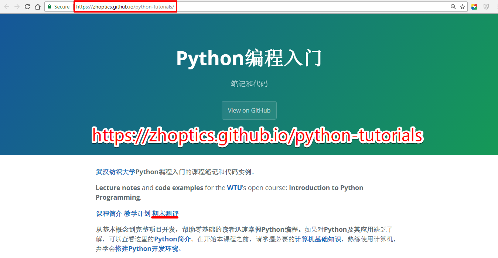

Python编程入门
=============

## 教师简介

**姓名：胡中华**

**职称：讲师**

**Email : zhoptics@foxmail.com**

**Mobile : +86 - 13659862476**

## 课程信息

* 课程名称：**Python编程入门**

* 课程性质：校公选课

* 学时学分：32学时，2学分

* 考核方式：考查

* 教学安排：

  |       班级       |     时间     |       地点        |   周次   |
  | :------------: | :--------: | :-------------: | :----: |
  | 全校各专业班级 | 周四  晚上10-12节 | YG03-118 | 第1-11周 |

## 参考教材

1. Eric Matthes[著], 袁国忠[译]. **Python编程：从入门到实践**. 北京: 人民邮电出版社, 2016 
  
2. 在[**京东**](http://www.jd.com)、[**当当**](http://www.dangdang.com)、[**淘宝**](http://www.taobao.com)、[**纺大图书馆**](http://lib.wtu.edu.cn/)搜索关键词: **`Python`**，任何一本相关书籍均可
3. 廖雪峰的[**Python教程**](https://www.liaoxuefeng.com/wiki/0014316089557264a6b348958f449949df42a6d3a2e542c000).
4. Vamei的[**Python快速教程**](http://www.cnblogs.com/vamei/archive/2012/09/13/2682778.html).
5. Swaroop, C. H, [**A Byte of Python**](https://www.gitbook.com/book/swaroopch/byte-of-python/details), 中文版[**简明Python教程**](https://bop.mol.uno/).

## 课程网站

**这里分享了教材上的笔记和代码 https://zhoptics.github.io/python-tutorials **

## 课程简介

Python是人工智能时代最流行的编程语言，同时也是国外很多著名大学的编程入门课。Python在人工智能、机器学习、深度学习、数据挖掘、数据分析、大数据、物联网、金融量化分析、Web开发、Linux运维与自动化测试、网络爬虫、游戏开发、图像处理、科学计算、GUI图形界面开发等领域得到了广泛的应用，因此学习Python是非常有必要的。

Python语法简洁，入门非常容易。人生苦短，我用Python！选修这门课，开启探索人工智能的大门！

主要教学内容包括：

1. Python编程基础
2. Python科学计算库：numpy, matplotlib等
3. Python项目实战：人脸识别

## 课堂要求

* 必须有一本教材或者参考书，写上自己的姓名、班级及学号
* 遵守上课纪律，保持安静，按时上课，不得无故旷课早退，禁止玩手机，禁止玩游戏
* 多动手练习，按时按质完成课堂及课后作业

## 成绩评定

1. 采用五级评分制：`优秀`，`良好`，`中等`，`及格`和`不及格`
2. 最终成绩由平时成绩(50%)和期末成绩(50%)组成，由教务系统自动换算成五级评分
3. 平时成绩评定由购买教材的情况、签到、课堂或课后作业共同决定，每次平时成绩最高10分
   -  购买教材的情况记录1次平时成绩，10分
   -  签到5次，每次10分，未到或早退记0分，共50分
   -  课堂或课后作业4次，每次最高10分，共40分
4. 期末成绩由大作业决定，满分100分

## 学习要领

- 能够静下心来学习，能坚持学习
- 重点把一本入门教材看通透，多敲代码多实践，不懂问题多百度
- 多动脑思考，多动手实践，日积月累，熟能生巧

