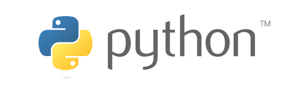
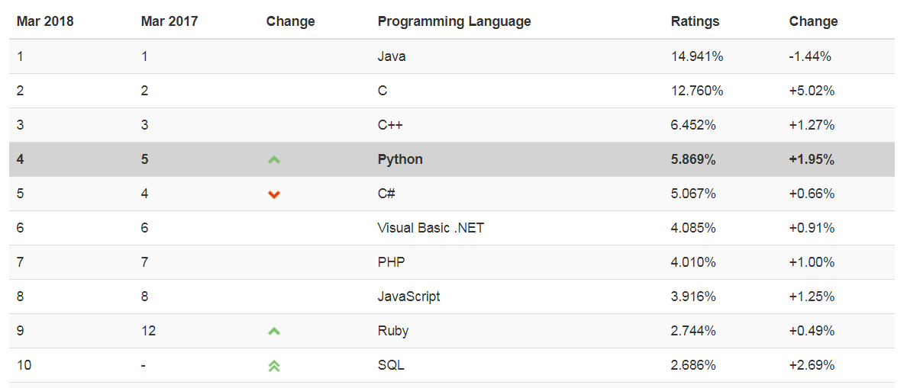
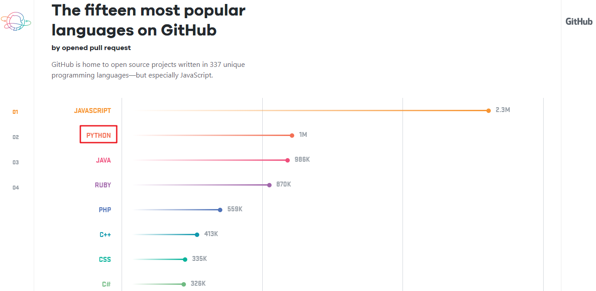
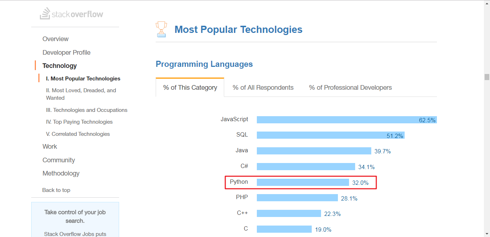
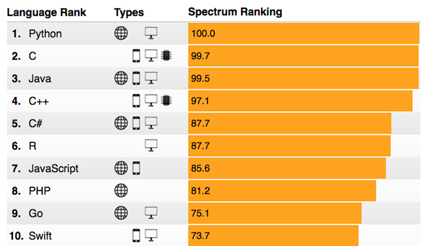
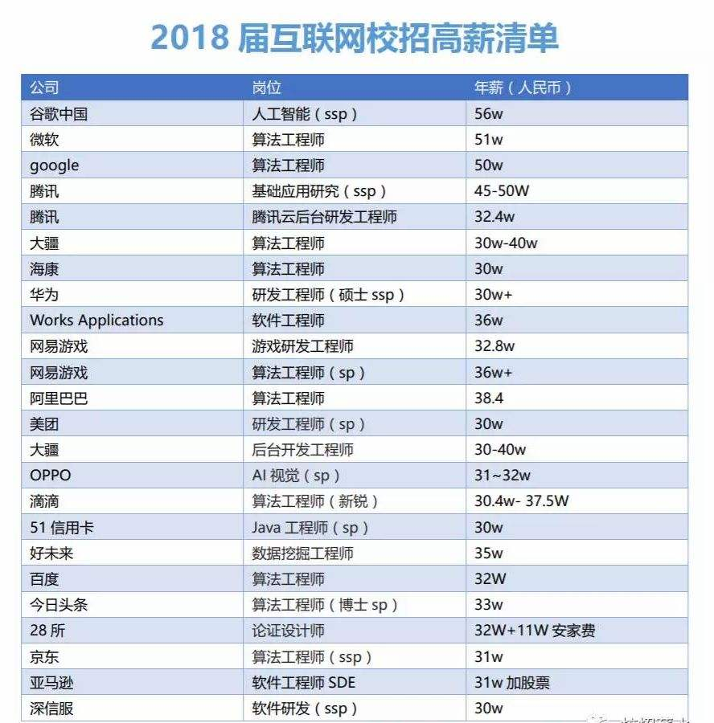
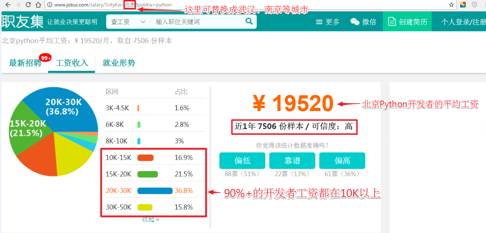
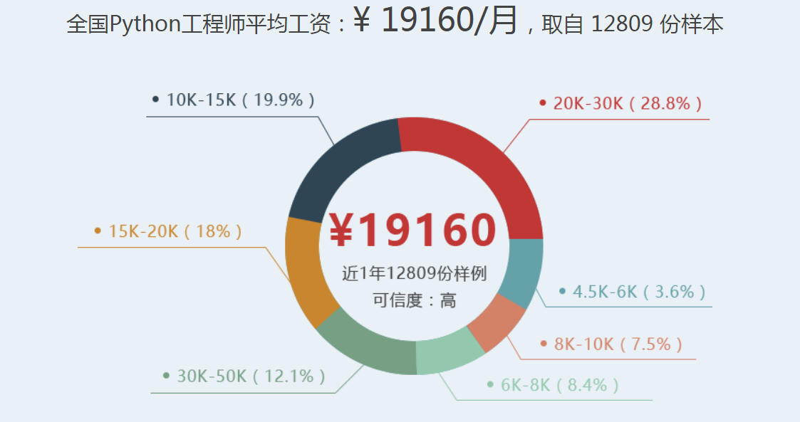

# Python语言简介

**Python**（英音：/ˈpaɪθən/  美音：/ˈpaɪθɑ:n/）是一种面向对象的、动态的、解释型的高级程序设计语言，是由著名的“**龟叔**”[**Guido van Rossum**](https://baike.baidu.com/item/Guido%20van%20Rossum)在1989年圣诞节期间发明的，第一个公开发行版发行于1991年。

龟叔给Python的定位是“简单”、“明确”、“优雅”，所以Python程序看上去总是简单易懂，零基础初学者学Python，不但入门容易，而且将来深入下去，可以编写非常复杂的程序。

Python提供了非常完善的基础代码库，覆盖了网络、文件、GUI、数据库、文本等大量内容，被形象地称作“内置电池（batteries included）”。用Python开发，许多功能不必从零编写，直接使用现成的即可。除了内置的库外，Python还有大量的第三方库，供你直接使用。

Python是开源、免费、跨平台的，不仅没有版权的困扰，而且编写的程序可以跨平台运行。当然，Python也有缺点，主要是运行速度慢和代码不能加密。但这并没有妨碍Python成为人工智能时代最流行的编程语言。

Python在人工智能、机器学习、深度学习、自然语言处理、数据挖掘、数据分析、大数据、物联网、金融量化分析、Web开发、Linux运维与自动化测试、网络爬虫、游戏开发、图像处理、计算机视觉、科学计算、GUI图形界面开发等领域得到了广泛的应用。

# Python语言排名

## 1. TIOBE排名

2018年3月，[**TIOBE**](https://www.tiobe.com/tiobe-index/)排名Python已经排在第4位。

## 2. Github排名

[**GitHub**](https://github.com)的[**调查报告** ](https://octoverse.github.com/)对于我们对未来的技术趋势判断有很大的参考意义，2017年Python排第2位。

## 3. Stack Overflow排名

国际著名的问答社区[**Stack Overflow**]在2017年的[**开发者调查报告**](https://insights.stackoverflow.com/survey/2017)中，Python的活跃程度排在第5位。

## 4. IEEE排名

 **IEEE Spectrum** 发布的[**研究报告**](http://spectrum.ieee.org/computing/software/the-2017-top-programming-languages)显示，2016 年排名第三的 Python 在2017年已经成为世界上最受欢迎的语言。

# Python薪酬待遇

## 1. 2018 AI工程师校招薪酬

今年互联网企业中研究深度学习、机器学习、人工智能等岗位比较火热，**校招年薪30万人民币只是起步价**。

## 2. 职友集Python工资查询

在[**职友集**](http://www.jobui.com/jobs/)上点击查工资，输入Python可以查看城市的工资信息，比如[**北京的Python工资**](http://www.jobui.com/salary/?cityKw=%E5%8C%97%E4%BA%AC&jobKw=python) 。

## 3. CSDN Python薪资调查

[**CSDN EDU**](https://edu.csdn.net/)上一个Python课程推介中提到的平均工资。

# Python应用领域

Python语言是编程语言界的**万能胶水**，Python的应用非常广泛，有非常好的生态，在[**PyPI**](https://pypi.python.org/pypi)社区有**1000+**的扩展包(packages)。用Python做应用要学会灵活调用这些packages，要学会当**调包侠** 。

| 应用领域 | packages                            |
| -------- | ----------------------------------- |
| 实用工具 | ipython, ipython notebook(Jupyter Notebook), Spyder, virtualenv |
| 科学计算 | numpy(+mkl), scipy, sympy, matplotlib |
| 数据分析、金融量化分析 | pandas, seaborn, Statsmodels, QuantLib |
| 大数据与云计算 | PySpark |
| 深度学习、机器学习、数据挖掘、人工智能 | tensorflow, theano, keras, scikit-learn, pytorch, cntk, Caffe, PaddlePaddle, scikit-neuralnetwork, xgboost|
| 自然语言处理NLP | nltk, Gensim|
| 语音识别 | DeepVoice, tensorflow, pyaudio,  librosa |
| 图像处理、机器视觉 | Pillow(PIL), opencv-python, scikit-image, vtk|
| Web开发 | Django, Flask, Jinjia2, Pyramid, Tornado|
| 数据库 | pymongo, sqllite, redis, mysql-connector-python, pymysql|
| GUI图形界面开发 | tkinter, pyqt, pyside, wxwidgets |
| Python自动化运维与测试 | Ansible, saltstack, selenium |
| 网络爬虫 |re, requests, urllib3, beautifulsoup4, scrapy|
| 游戏开发 | pygame |
| 三维图形建模 | pyopengl, pythonOCC |
| 生物信息| biopython |

**在工业界，包括Google、Facebook、Instagram、Baidu、Tencent、Alibaba、NASA等大公司和研究机构都在大量地使用Python**。

**在教育界，大部分美国著名大学的编程入门课都是Python，中国部分著名高校开设了Python编程课**。

**对我校本科生而言，比较接地气的就业方向：**

1. Python 网络爬虫

2. Python Web开发

3. Python自动化运维与测试

4. Python 数据分析与数据挖掘

# Python新闻速递

## 1. 国内教育新闻

以下新闻内容可以反应国家教育部对Python和人工智能重视。

1. 浙江省信息技术课程改革方案出台，Python 确定进入浙江省信息技术高考，从2018年起浙江省信息技术教材编程语言将会从 VB 更换为Python。北京和山东也将也确定要把 Python 编程基础纳入信息技术课程和高考的内容体系，山东省最新出版的小学信息技术六年级教材也加入了 Python 内容。
2. 2017 年 10 月 11 日，教育部考试中心发布了“关于全国计算机等级（NCRE）体系调整”的通知，决定自 2018 年 3 月起，在计算机二级考试加入了“Python 语言程序设计”科目。
3. 2018年1月16日上午，教育部召开新闻发布会，介绍了《普通高中课程方案和语文等学科课程标准（2017年版）》的有关情况，并重新修订了语文等14门学科的课程标准。在此次“新课标”改革中，正式将人工智能、物联网、大数据处理划入新课标，这也就意味着今年秋季入学的高中生，将要开始学习Python了。

## 2. 中国政府政策

以下内容整理自2018年两会时政评论：[**刚刚，两会宣布人工智能重大消息**](https://mp.weixin.qq.com/s?__biz=MjM5NzA1MTcyMA==&mid=2651166390&idx=1&sn=b4e18fd183ae28b21647bd64dfb3443c&chksm=bd2eda918a59538736cc3f8b7125b9acc10a993bb3ff6ae0c6e29aec1c663904d32e36af0999&mpshare=1&scene=23&srcid=03062O7SGfeeq4CagdrrWaK3#rd)

* 2015 年 5 月，国务院印发《中国制造 2025》，其中“智能制造”被定位为中国制造的主攻方向，而这里智能的概念，其实可以看做人工智能在制造业的具象体现。

* 2015 年 7 月，国务院印发《国务院关于积极推进“互联网+”行动的指导意见》，其中人工智能是重点布局的 11 个领域之一。

* 2016 年 3 月，《国民经济和社会发展第十三个五年规划纲要（草案）》发布，国务院提出，要重点突破新兴领域的人工智能技术。

* 2016 年 5 月，发改委、科技部、工信部和网信办联合印发《“互联网+”人工智能三年行动实施方案》，提出到 2018 年“形成千亿级的人工智能市场应用规模”。

* 2016 年 7 月，国务院印发《“十三五”国家科技创新规划》。《规划》指出，要重点发展大数据驱动的类人智能技术方法；突破以人为中心的人机物融合理论方法和关键技术，研制相关设备、工具和平台；在基于大数据分析的类人智能方向取得重要突破，实现类人视觉、类人听觉、类人语言和类人思维，支撑智能产业的发展。

* 2017 年 3 月，人工智能首次被写入国务院的《政府工作报告》，正式进入国家战略层面。

* 2017 年 7 月，国务院印发《新一代人工智能发展规划》，提出了“三步走”的战略目标，宣布举全国之力在 2030 年抢占人工智能全球制高点，人工智能核心产业规模超过 1 万亿元，带动相关产业规模超过 10 万亿元。

* 2017 年 11 月 15 日，科技部召开了新一代人工智能发展规划暨重大科技项目启动会，宣布首批国家新一代人工智能开放创新平台名单：百度、阿里云、腾讯、科大讯飞！

* 2017 年 12 月，工业和信息化部印发《促进新一代人工智能产业发展三年行动计划（2018-2020年）》。计划提出，以信息技术与制造技术深度融合为主线，以新一代人工智能技术的产业化和集成应用为重点，推进人工智能和制造业深度融合，加快制造强国和网络强国建设。

* 2018年3月，李克强总理在对 2018 年政府工作的建议中讲到：2018 年要发展壮大新动能。做大做强新兴产业集群，实施大数据发展行动，加强新一代人工智能研发应用，在医疗、养老、教育、文化、体育等多领域推进「互联网+」，发展智能产业，拓展智能生活。

# Python版本选择

Python有Python 2 和 Python 3两个版本，对入门学习而言，在使用上两个版本的区别不大，选择任何一个版本都可以。但Python 2 即将在2020年停止支持，**建议选择Python 3.5/3.6的版本**，绝大部分第三方库都完美地支持了Python 3.5/3.6。

如果你使用的是**Windows XP**操作系统，只能使用Python 2.7 和Python 3.4。

如果你使用的是64位**Windows 7/10**，只能在安装Python 3.5+以上的版本安装tensorflow。

**Python 2和Python 3的区别:**
1. print 在Python 2中，print是一个语句，后面可以不加括号；在Python 3中，print是一个函数，后面必须加括号
2. 除法 “/”在Python 2中表示整除，在Python 3中表示精确的除法，Python 3中整除用“//”表示，在Python 2中可以使用`import __future__ `来体验Python 3中的函数
3. Python 2对中文支持不好，如果要输入中文字符或者注释，需要在文本文件首行标注**# -*- coding:utf-8 -*-**或者**coding=utf-8**(只识别coding和utf-8，其它字符不识别)
4. 输入函数：在Python 2中有raw_input()和input()函数, 在Python 3中只有input()
5. third-party packages的支持有所不同，Python 2更多一些，但是绝大部分的package都会支持Python 3
6. [Python 2与Python 3的区别官网详解](https://wiki.python.org/moin/Python2orPython3)

